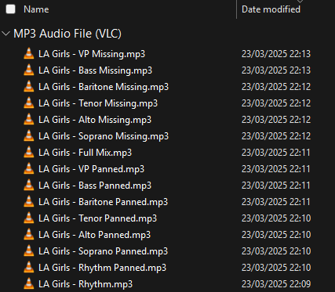
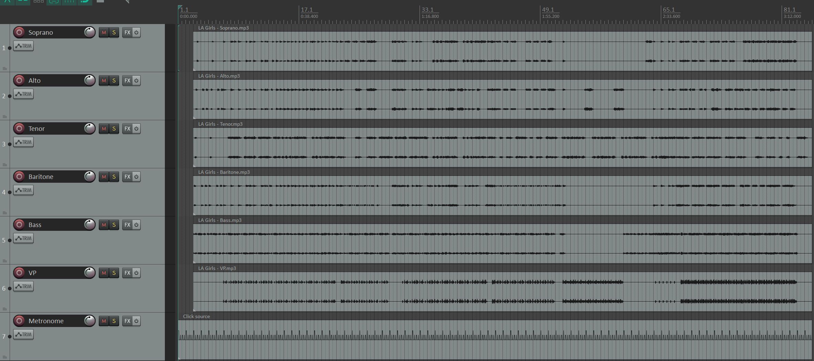

This repository contains scripts to extend functionality in REAPER.
They are written in Lua using the built-in [ReaScript API](https://www.reaper.fm/sdk/reascript/reascript.php), with the added functionality of the [Ultraschall API Library](https://mespotin.uber.space/Ultraschall/US_Api_Introduction_and_Concepts.html)

## Features
Currently I only have one script which is designed to make custom configurations for choir or a cappella learning tracks. It renders the following configurations of the tracks in a Reaper project:
- Each part panned hard left, with the other parts panned hard right
- A full mix of all parts, with panning across the stereo spectrum so that each part has its own space
- A mix with each part missing, so that you can test yourself to see how well you hold your part without the support of the other parts (these use the same panning arrangement as the full mix)
- Rhythm only track (Bass and Vocal Percussion) for arrangements that have a VP part
- Rhythm panned part, like the other panned tracks, except that both Bass and VP are panned hard left

## Usage
Importantly, this script was written for _my own_ convenience and contains a number of _hardcoded shortcuts_ - in other words, it is only designed to work under certain circumstances:
- If you wish to include a metronome, it must be the _last_ track, and named either "Click" or "Metronome"
- The panning arrangements are only defined for 4, 5, or 6 parts
  - There are separate panning arrangements for SATB and Barbershop parts. If you wish to use the Barbershop panning pattern, name your first track "Tenor"
- Exporting rhythm learning tracks assumes that the Bass and VP are the last two tracks (excluding metronome)
- You may need to edit the script yourself to enable or disable some features. 

Here is an example of the final products after exporting:

Here is an example of how I set up my projects to use the script:

## Future Works
I have further improvements to this script planned, but I may or may not get to them. Those include:
- A GUI for ease of use
- Options to choose panning hard left or hard right
- Options to select a custom panning arrangement for full mix and part missing tracks
- Options to select custom combinations of different parts present, not just Bass and VP
