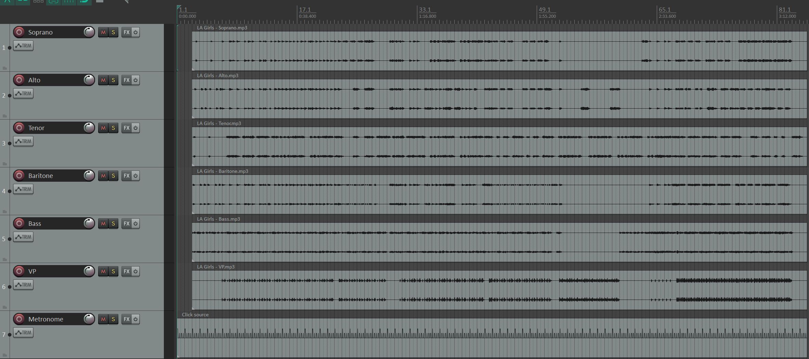
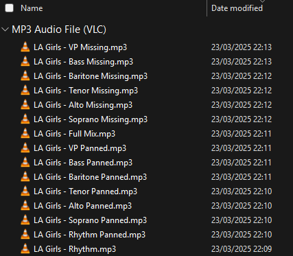

This repository contains scripts to extend functionality in REAPER.
They are written in Lua using the built-in [ReaScript API](https://www.reaper.fm/sdk/reascript/reascript.php), with the added functionality of the [Ultraschall API Library](https://mespotin.uber.space/Ultraschall/US_Api_Introduction_and_Concepts.html)

## Features
Currently I only have one script which is designed to make custom configurations for choir or a cappella learning tracks. It renders the following configurations of the tracks in a Reaper project:
- Each part panned hard left, with the other parts panned hard right
- A full mix of all parts, with panning across the stereo spectrum so that each part has its own space
- A mix with each part missing, so that you can test yourself to see how well you hold your part without the support of the other parts (these use the same panning arrangement as the full mix)
- Rhythm only track (Bass and Vocal Percussion) for arrangements that have a VP part
- Rhythm panned part, like the other panned tracks, except that both Bass and VP are panned hard left

## Usage
### Installation
First, follow the instructions for how to install the [Ultraschall API](https://mespotin.uber.space/Ultraschall/US_Api_Introduction_and_Concepts.html#:~:text=%5E%20How%20to%20install%20Ultraschall%20API)

Then, download this entire repository. You can do that by clicking the green 'Code' button at the top, then clicking download zip. Unzip the file into your REAPER scripts folder. In Windows, you can find it at `C:\Users\\(your username)\AppData\Roaming\REAPER\Scripts\`

### Using Templates
There are templates available with everything set up already. These are _optional_ but recommended. All you need to do is copy the contents of the `Learning Track Templates` folder into `C:\Users\\(your username)\AppData\Roaming\REAPER\ProjectTemplates\`. Then you can create a new project in REAPER by clicking File at the top of your screen, then Project Templates, and selecting the relevant one.

### Creating your learning tracks
Open up REAPER and create a new project. Import each stem as its own track, and name the tracks accordingly. _(Note: This program uses specific track names to identify certain parts. See [Usage Notes](https://github.com/abhchow/reaper_scripts?tab=readme-ov-file#usage-notes))_ You should have something that looks like this:

Then, click Actions at the top of your screen, and click Show Action List. Then, click Script: learning_tracks.lua and click Run. Now it will create all of the learning tracks for you. They will appear inside the folder your project is saved in, and you will see a final product that looks something like this:

### Usage Notes
Importantly, this script was written for _my own_ convenience and contains a number of _hardcoded shortcuts_ - in other words, it is only designed to work under certain circumstances:
- You can set your faders however you like, and the program will adjust volumes for each learning traack relative to how you set the faders
- If you wish to include a metronome, it must be the _last_ track, and named either "Click" or "Metronome"
  - The templates include a metronome and have a synth set up to use as a pitch pipe. Just double click on the synth to open the midi menu and change the note.
- The hard panned part tracks have the following defaults:
  - The main part is panned hard left and the other parts are panned hard right. You can change this by changing the value of `hard_pan_position` to 1 instead of -1
  - The main part is 3 times louder than the other parts. You can change thiss by changing the value of `hard_pan_volume`
- The full mix and part missing tracks have a panning arrangement that puts specific parts in specific panning spots. These panning arrangements are only defined for 4, 5, or 6 parts
  - There are separate panning arrangements for SATB and Barbershop parts. If you wish to use the Barbershop panning pattern, name your first track "Tenor"
  - You must name any beatbox/vocal percussion parts "VP". Otherwise your VP will end up panned somewhere else.
  - The panning arrangements can be customised by editing the script and changing the sequence of numbers in the `get_positions()` function. The smaller the number the further left, the larger the number the further right. You can put in any numbers and the script will adjust automatically for you.
    - You can also adjust the width in the `positions_to_pans()` function. By default the width is 0.6.
- Exporting rhythm learning tracks assumes that the Bass and VP are the last two tracks (excluding metronome)
- You may need to edit the script yourself to enable or disable some features. 

## Future Works
I have further improvements to this script planned, but I may or may not get to them. Those include:
- A GUI for ease of use
- Options to select a custom panning arrangement for full mix and part missing tracks
- Options to select custom combinations of different parts present, not just Bass and VP
- Extract settings into a `settings.yaml` file
